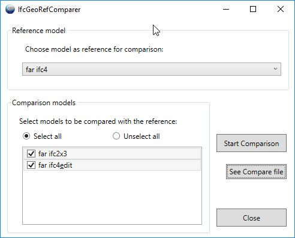
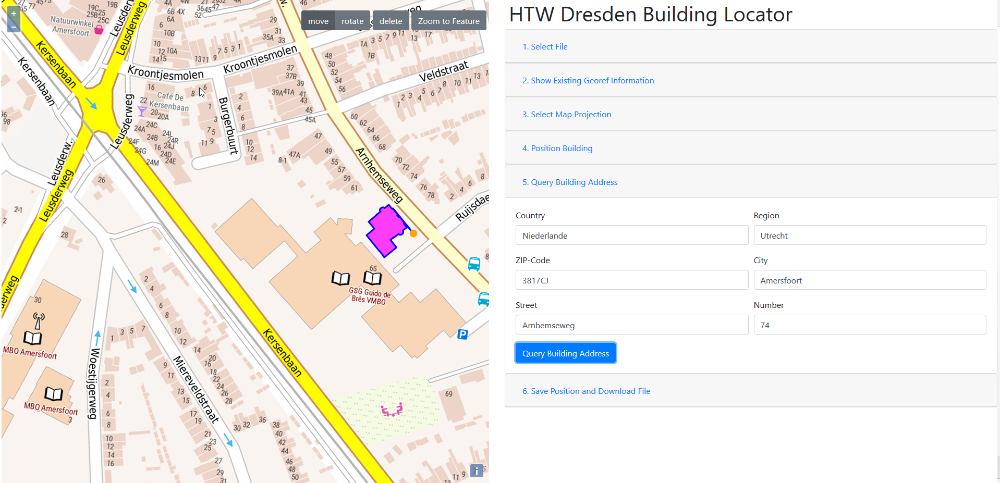
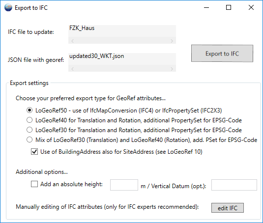

 

# IfcGeoRefChecker- Kurzanleitung

[TOC]

## Das -IFCGeoRefChecker- Tool (Version: 0.3.1.0)


### GeoRefChecker Funktionsumfang

1. **"Arbeitsverzeichnis festlegen" Bereich**
-- optional, aber empfohlen über die Schaltfläche Ändern...
-- einige Exportdateien werden dort gespeichert
-- Sie benötigen die Berechtigung, dort hinein zu schreiben

2. **"Überprüfe IFC-Datei(en)..." Button**
-- Hauptfunktionalität
-- automatischer Export von Log- und/oder json-Datei ins Arbeitsverzeichnis möglich (wenn Checkboxen aktiviert sind)
-- Prüfung einer oder mehrerer IFC-Dateien pro Import auf LoGeoRef-Konzept (siehe Dokumentation)
-- importierte und geprüfte Modelle werden in der Liste im Bereich: "Statusmeldung" angezeigt

3. **"GeoRefCheck Überblick" Bereich**
-- kurze Ergebnisse des festgestellten Georeferenzierungsgrades der IFC-Datei(en)
-- Umschalten zwischen den Ergebnissen durch Auswahl der Modelle in der Liste oben im Bereich "Statusmeldung"
-- (wenn vorher angehakt) Schaltflächen zur Anzeige der Log- und/oder JSON-Datei

4. **"--> GeoRefComparer" Button**
-- Vergleich von georeferenzierenden Attributwerten zweier oder mehrerer IFC-Dateien
-- siehe [GeoRefComparer]( #Comparing) georef)

5. **"Aktualisiere GeoRef" Bereich**
-- Möglichkeit zur Aktualisierung/Änderung der Georeferenzierung Ihrer IFC-Datei
-- erster Schritt: Georeferenzierungsattribute manuell ODER über Karte (externe Web-App) aktualisieren
-- zweiter Schritt: Aktualisierungen in IFC-Datei exportieren
-- siehe [GeoRefUpdater](#Updating georef)

<a name="Comparing georef"></a>
### IfcGeoRefComparer



1. **"Referenzmodell" Bereich**
-- wählen Sie die IFC-Datei, die als Referenz für den Vergleich dienen soll
-- normalerweise ist das das Koordinationsmodell (mit korrekten Georeferenzdaten)

2. **"Vergleichsmodelle" Bereich**
-- wählen Sie die Modelle aus, die mit dem Referenzmodell verglichen werden sollen
-- bitte beachten Sie: sie werden nicht miteinander verglichen
-- normalerweise sind das die Modelle der beteiligten Gewerke

3. **"Starte Vergleich" Button**
-- Start des Vergleichs
-- interner Export der Vergleichsprotokolldatei in das Arbeitsverzeichnis
-- Schnellansicht der Vergleichsdatei durch Klick auf den Button "Vergleichsdatei ansehen"

<a name="Updating georef"></a>
### Aktualisiere GeoRef Funktionsumfang

#### Erste Variante: bearbeiten "...via manuelle Eingabe"


Möglichkeit zur manuellen Bearbeitung von Adresse, Geolocation (Geographische Standortkoordinaten) und Geodätische Transformation.
Über "Speichern und Schließen" werden die neuen Attributwerte als json-Datei in einem benutzerdefinierten Verzeichnis gespeichert.
Die json-Datei wird für den weiteren IFC-Export benötigt.

#### Zweite Variante: bearbeiten "...via Browser-Karte"

1. **Berechnung des Gebäudeumrisses**
-- für die spätere Darstellung in der Karte berechnet die Anwendung intern den Gebäudeumriss aus der Wandgeometrie in der IFC-Datei
-- aufgrund der vielfältigen Speichermöglichkeiten der Geometrie in IFC ist dies fehleranfällig
-- bitte kontaktieren Sie uns, wenn die Berechnung fehlschlägt oder fehlerhaft ist

2. **Speichern von json mit Gebäudeumriss**
-- die Anwendung fordert zum Speichern der json-Datei mit dem berechneten Gebäudeumriss auf
-- bitte speichern Sie die Datei im Arbeitsverzeichnis oder in einem anderen bekannten Ordner

3. **"Building Locator" wird geöffnet**
-- Start des "Building Locator" durch Öffnen des lokal eingestellten Browsers
-- auf der linken Seite wird eine Karte angezeigt
-- falls nicht, überprüfen Sie Ihre Internetverbindung und/oder versuchen Sie einen anderen Browser
-

4. **Georef aktualisieren über "Building Locator "**
- **Datei auswählen:** 
-- Importieren Sie die json-Datei mit dem berechneten Gebäudeumriss (WKTRep-Attribut in json-Datei)

- **Vorhandene Georef-Informationen anzeigen**
-- Anzeige des Georef-Inhalts in der json-Datei

- **Kartenprojektion wählen**
-- Auswahl einer der angebotenen Projektionen

- **Gebäude positionieren**
-- Anzeige der WKT-Zeichenkette, die den Gebäudeumriss repräsentiert
-- über **Gebäude zeichnen** Darstellung des Gebäudes und seines Projektbasispunktes in der Karte
-- die Positionierung orientiert sich an den Level50-Attributen oder, wenn diese nicht angegeben sind, an der LatLon-Koordinate von Level20
-- benutzerdefinierte Positionierung über **Verschieben** und **Drehen** Funktionalität

- **Gebäudeadresse abfragen**
-- liefert die Adresse des gewählten Ortes
-- Quelle: [Nominatim](https://nominatim.org/release-docs/develop/api/Overview/)

- **Position speichern und Datei herunterladen**
-- Aktualisieren der georef json-Datei
-- Download in Arbeitsverzeichnis oder benutzerdefinierten Ordner

#### Änderungen in IFC exportieren



1. **Aktualisierungen nach IFC über IfcGeoRefChecker** exportieren
-- Import der aktualisierten json-Datei aus dem Dateisystem
-- Auswahl der gewünschten Exportoptionen (abhängig von Ihrer BIM-Software)
-- Möglichkeit, IFC-Attribute manuell zu bearbeiten, siehe [IFC-Export für Experten](#Erweiterter Export)

<a name="Extended export"></a>

#### Erweiterter Export nach IFC (nur für IFC-Experten empfohlen)


- Aktualisieren von Georef über das Konzept der Georeferenzierungsebene
- Anzeige von Attributwerten bestimmter Ebenen und ihrer zugehörigen IFC-Entitäten

## Programmiert mit

- [xBIM Toolkit](http://docs.xbim.net/) - Hauptfunktionalität zum Lesen von IFC-Dateien
- [Json.NET](https://www.newtonsoft.com/json) - Funktionalität zum Exportieren von JSON-Dateien
- [Pixabay](https://pixabay.com/) - Grafiken, die zur Gestaltung von LoGeoRef-Icons verwendet werden

##Mitwirkende

Das Konzept mitsamt dem Tool wurde im Rahmen der folgenden Förderprojekte entwickelt:

| 3D-Punktwolke - CityBIM  | Digitalisierung des Bauwesens - DD BIM |
|--------|--------|
|       |   Supported by: <br>  <br> Landeshauptstadt Dresden <br>Amt für Wirtschaftsförderung |

## Kontakt

   

**HTW Dresden**
**Fakultät Geoinformation**
Friedrich-List-Platz 1
01069 Dresden

Projektleiter:

- Prof. Dr.-Ing. Christian Clemen (<christian.clemen@htw-dresden.de>)

Projektmitarbeiter:

- Hendrik Görne, M.Eng. (<hendrik.goerne@htw-dresden.de>)
- Tim Kaiser, M.Eng.
- Enrico Romanschek, M.Eng.

## Lizenz

Dieses Projekt ist unter der MIT-Lizenz lizenziert:

```
Copyright (c) 2019 HTW Dresden
Permission is hereby granted, free of charge, to any person obtaining a copy
of this software and associated documentation files (the "Software"), to deal
in the Software without restriction, including without limitation the rights
to use, copy, modify, merge, publish, distribute, sublicense, and/or sell
copies of the Software, and to permit persons to whom the Software is
furnished to do so, subject to the following conditions:
The above copyright notice and this permission notice shall be included in all
copies or substantial portions of the Software.
THE SOFTWARE IS PROVIDED "AS IS", WITHOUT WARRANTY OF ANY KIND, EXPRESS OR
IMPLIED, INCLUDING BUT NOT LIMITED TO THE WARRANTIES OF MERCHANTABILITY,
FITNESS FOR A PARTICULAR PURPOSE AND NONINFRINGEMENT. IN NO EVENT SHALL THE
AUTHORS OR COPYRIGHT HOLDERS BE LIABLE FOR ANY CLAIM, DAMAGES OR OTHER
LIABILITY, WHETHER IN AN ACTION OF CONTRACT, TORT OR OTHERWISE, ARISING FROM,
OUT OF OR IN CONNECTION WITH THE SOFTWARE OR THE USE OR OTHER DEALINGS IN THE
SOFTWARE.
```
